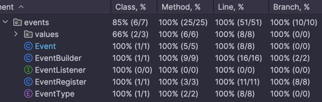
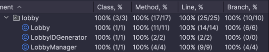
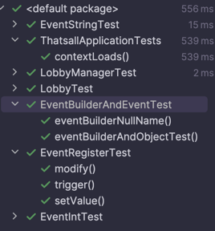

# Unit tests
- Started with least co-dependant parts: packages "events" and "lobby"
- Others packages are more dependant on others and are still subject to redesigns, so will be covered as implementation goes forward
- Using JUNIT for tests
- And built-in coverge tool from IntelliJ
- 22 tests

# Events

# Lobby

# Tests itself

# Reflections
- Writing basic tests (getter/setter like) is quite mundane, will probably look into automation (hi chatgpt)...
- but tests for higher-level stuff aren't that bad
- Calling test implementation classes Sheeps (eg. ListenerSheep) makes it funnier
- Hitting sucesful tests and high/perfect coverge is surprisingly satisfying
- TDD is challenging while coding something new experience-wise